# Python Course Repository

This repository contains my coursework for the Python course. Each exercise is organized into separate folders for easy navigation.

## Folder Structure

- [Exercise 1.1: Getting Started with Python](#exercise-11-getting-started-with-python)
- [Exercise 1.2: Data Types in Python](#exercise-12-data-types-in-python)
- [Exercise 1.3: Operators & Functions in Python](#exercise-13-operators--functions-in-python)
- [Exercise 1.4: File Handling in Python](#exercise-14-file-handling-in-python)
- ...

## Getting Started

To access the exercises, simply navigate to the respective folders. Each folder contains the necessary files and instructions for completing the exercise.

## Exercise 1.1: Getting Started with Python

Install Python, check your version with python --version.

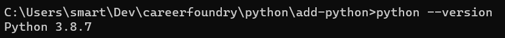

Create a new virtual environment named "cf-python-base", using the command **mkvirtualenv** cf-python-base
and then install iPython Shell to it with pip install ipython

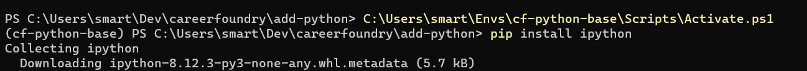

Create a test with numbers and variables, having the user input numbers and print the result of them added together

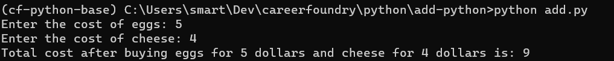

Export a requirements file:

1. Generate a requirements.txt file from source with **pip freeze > requirements.txt** command.

2. Create a new environment variable called cf-python-copy and then run the command **pip install -r requirements.txt**

## Exercise 1.2: Data Types in Python

Completed tasks 1-5 and added them to exercise 1.2 folder

Created each recipe individually using a Dictionary. I chose a dictionary because it is easier
to add multiple different data types and label each.

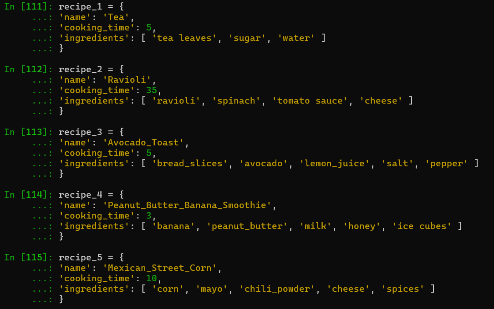

Created an all_recipes list to store each recipe dictionary. I chose to use a list for all_recipes
since each recipe is the same data type and it's easier to go through a list.

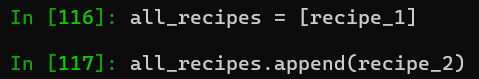

Added all the recipes to the "all_recipes" list and printed the all_recipes list.

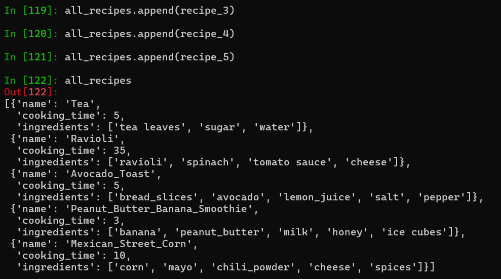

Printed ingredients lists for all recipes.

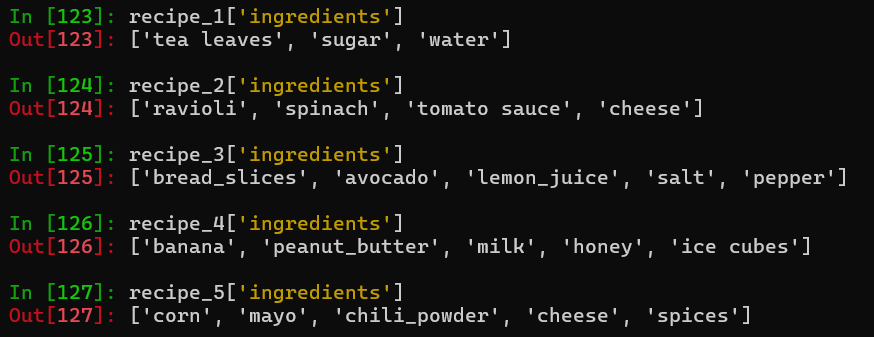

## Exercise 1.3: Operators & Functions in Python

Initialize the global variables for both the recipe book and all the ingredients

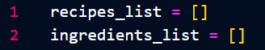

Create a function to get the recipe from the user. Get user input for the Name of the recipe, the time it took to cook and each of the ingredients.

Use .split(',') in the ingredients input to allow the user to separate each ingredient or use a while loop with a "STOP" input to break when the user enters "STOP".

Then create and return a dictionary "recipe" of the name, cooking time, and ingredients list.

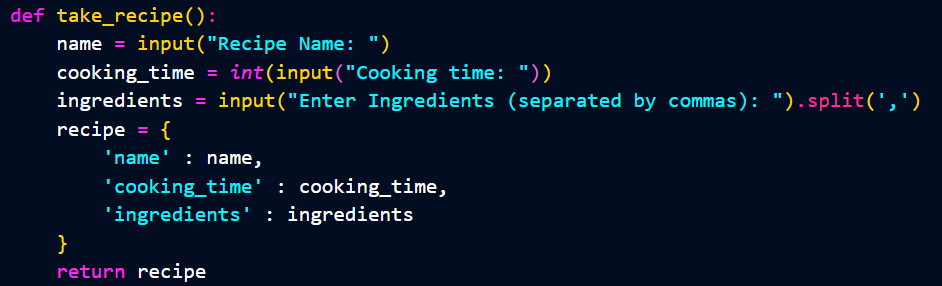

Ask user to input amount of recipes, then loop through each of the recipes, adding them to the recipes_list and any new ingredients to the ingredients_list.

The first for loop repeats for the amount of recipes the user input, n, and initializes a new recipe by using the take_recipe() function which we already created. Then it appends the current recipe to the recipes_list.

The second for loop looks at each ingredient in the current recipe and checks if the ingredients_list does **not** contain the ingredient already. If not, the ingredient is added to the list.

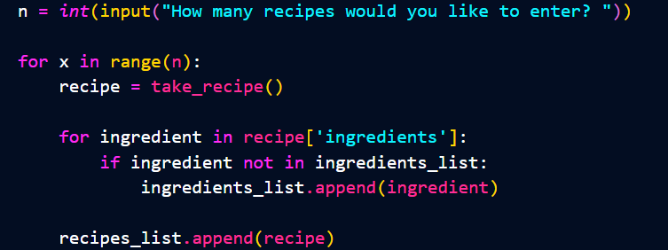

Create difficulty rating for each recipe. Create conditionals for if the recipe is above or below 10 minutes cooking time and/or if the recipe contains above or below 4 ingredients. Then append to the reciples list by adding the new key-value pair to the dictionaries with ```recipe['difficulty'] = difficulty```.

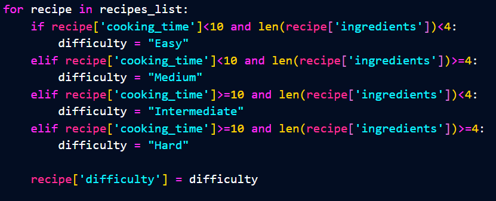

Print out each recipe with the name, cooking time, ingredients, and difficulty. Iterate through each ingredient to have them print on individual lines.

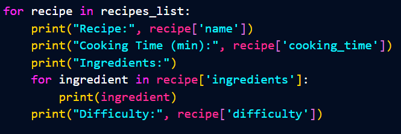

Print all the ingredients needed to make all the recipes by printing the ingredients_list.  Again, iterating through each ingredient in a for loop so they print on their own line.

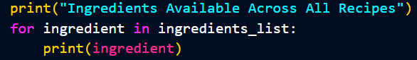

Go into powershell/command prompt and go into the folder with Exercise1.3.  Then turn on the virtual environment and run ```python Exercise_1.3.py```.  Follow the prompts to see your next grocery list!

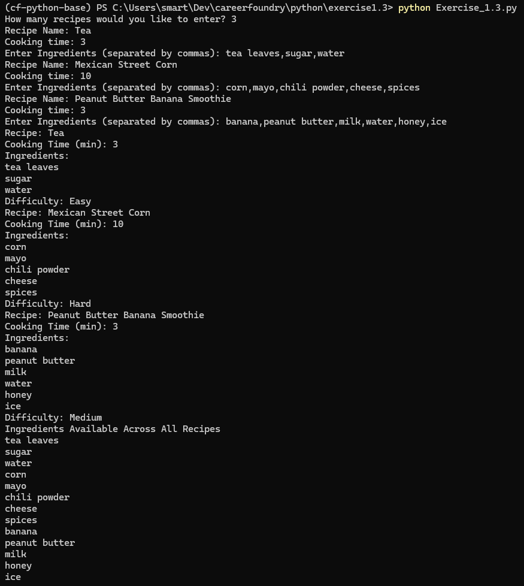

